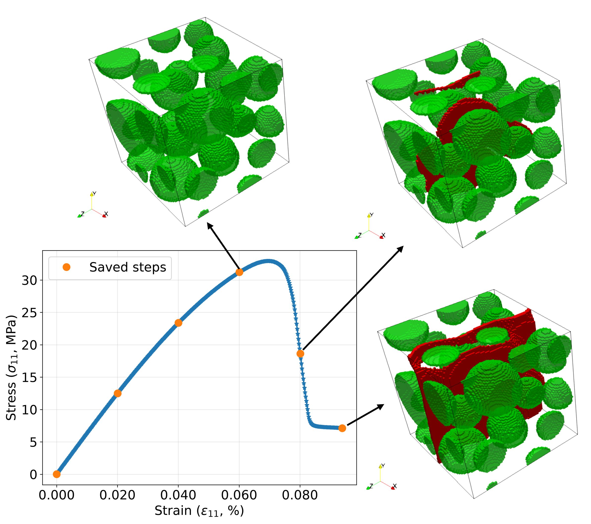
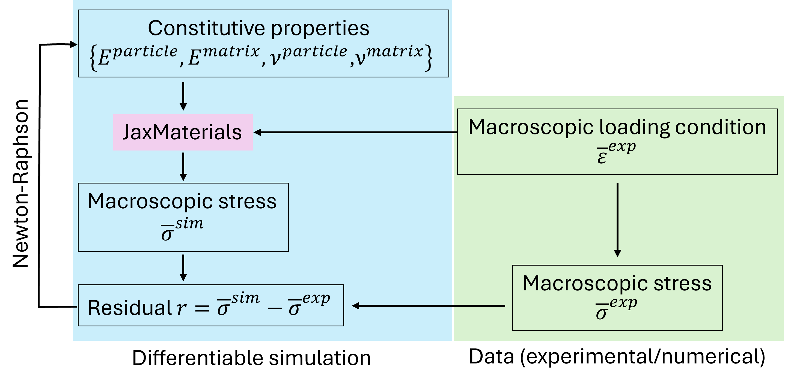
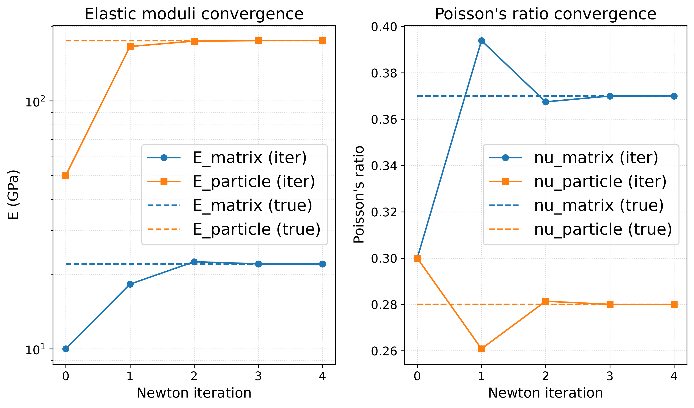

# diffmat

**Differentiable Materials Modelling**

`diffmat` is a research-oriented Python codebase for **differentiable materials modelling**.  
It uses an **[JAX](https://docs.jax.dev/en/latest/index.html#) based FFT numerical solver [JaxMaterials](https://github.com/eikehmueller/JaxMaterials#)**, enabling end-to-end differentiability of m[...]

This makes the framework suitable for gradient-based methods such as:
- Inverse material parameter identification
- Sensitivity analysis
- Optimisation
- Machine-learning-assisted constitutive modelling

---

## Key Ideas

- FFT-based solvers for computational materials modelling  
- JAX implementation for automatic differentiation  
- Designed for numerical simulation of material behaviour  
- Research-focused, modular, and extensible codebase  

---

## Installation

### 1. Set up a virtual environment

We recommend using conda to create an isolated environment:

```bash
conda create -n diffmat python=3.12
conda activate diffmat
```

### 2. Install JAX

Install JAX with CUDA 12 support (adjust for your setup if needed):

```bash
pip install -U "jax[cuda12]"
```

### 3. Install JaxMaterials

Clone and install JaxMaterials, which is a dependency of diffmat:

```bash
git clone git@github.com:eikehmueller/JaxMaterials.git
cd JaxMaterials/
pip install .
```

If you plan to modify JaxMaterials as part of your development, use the editable install instead:

```bash
pip install -e .
```

### 4. Install diffmat

Clone and install diffmat in editable mode for development:

```bash
git clone https://github.com/yang-chen-2022/diffmat.git
cd diffmat/
pip install -e .
```

---

## Example projects

### Phase-Field Fracture Simulation of Composites (`example/example_pfm.py`)

<figure style="margin: 0; text-align: center;">
  
  <figcaption style="text-align: center;">
Phase-field fracture simulation of a particle-reinforced composite under tension.
</figcaption>
</figure>

### Topology Optimisation (`examples/example_to.py`)

<figure style="margin: 0; text-align: center;">
  
  <figcaption style="text-align: center;">
Topology optimisation of porous materials for maximising the bulk modulus.
</figcaption>
</figure>

### Material parameter identification (`examples/example_inv_elas.py`)

<figure style="margin: 0; text-align: center;">
  
  <figcaption style="text-align: center;">
Material parameter identification workflow.
</figcaption>
</figure>

    
    
<figure style="margin: 0; text-align: center;">
  
  <figcaption style="text-align: center;">
Newton-Raphson iteration convergence of parameter identification procedure.
</figcaption>
</figure>

---

## Background and Acknowledgements

The initial development of `diffmat` builds upon and is inspired by [JaxMaterials](https://github.com/eikehmueller/JaxMaterials) (Eike Müller).

---

## Project Status

🚧 **Active research code**  
This project is under ongoing development. The API, numerical formulations, and features may change.

---

