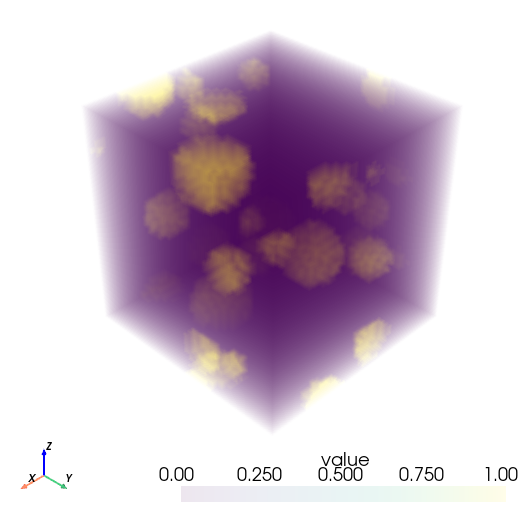

# diffmat

**Differentiable Materials Modelling**

`diffmat` is a research-oriented Python codebase for **differentiable materials modelling**.  
It uses an **[JAX](https://docs.jax.dev/en/latest/index.html#) based FFT numerical solver [JaxMaterials](https://github.com/eikehmueller/JaxMaterials#)**, enabling end-to-end differentiability of m[...]

This makes the framework suitable for gradient-based methods such as:
- Inverse material parameter identification
- Sensitivity analysis
- Optimisation
- Machine-learning-assisted constitutive modelling

---

## Key Ideas

- FFT-based solvers for computational materials modelling  
- JAX implementation for automatic differentiation  
- Designed for numerical simulation of material behaviour  
- Research-focused, modular, and extensible codebase  

---

## Installation

### 1. Set up a virtual environment

We recommend using conda to create an isolated environment:

```bash
conda create -n diffmat python=3.12
conda activate diffmat
```

### 2. Install JAX

Install JAX with CUDA 12 support (adjust for your setup if needed):

```bash
pip install -U "jax[cuda12]"
```

### 3. Install JaxMaterials

Clone and install JaxMaterials, which is a dependency of diffmat:

```bash
git clone git@github.com:eikehmueller/JaxMaterials.git
cd JaxMaterials/
pip install .
```

If you plan to modify JaxMaterials as part of your development, use the editable install instead:

```bash
pip install -e .
```

### 4. Install diffmat

Clone and install diffmat in editable mode for development:

```bash
git clone https://github.com/yang-chen-2022/diffmat.git
cd diffmat/
pip install -e .
```

---

## Test Cases

### Phase-Field Fracture Model (`test/test_pfm.py`)

This test demonstrates a phase-field fracture simulation applied to a composite material with particle inclusions. 
The differentiability is applied to the identification of the characteristic length of the inclusion material. In phase-field fracture model, this characteristic length cannot be measured experimentally, and often calculated based on 1D simplifications (neglecting Poisson's effect). Identification of this model parameter can be done with Newton's method, requiring sensitivity information of the model output to the parameter(s) to be identified. This sensitivity (derivatives) has been obtained in the literature using numerical perturbation method, see e.g. [Nguyen et al. 2016](https://www.sciencedirect.com/science/article/pii/S0022509616302563#s0060). At every Newton iteration, the perturbation method requires $1+p$ simulations for forward-finite-difference scheme or $1+ 2p$ solves for central-finite-difference scheme, with $p$ the number of parameters to be identified. It is clear that this method becomes impractical when $p$ is a large number. This highlights the advantage of differentiable modelling, which only requires $2$ simulations (1 forward solve $+$ 1 adjoint solve). Another advantage of differentiable modelling in this context is that it gives "exact" values of the derivatives up to the model accuracy (discretisation error and machine precision error), while the perturbation method suffers from the truncation error and round-off error of the finite difference scheme. The truncation error is $O(h)$ for forward difference and $O(h^2)$ for central difference (high if $h$ is large), whereas the round-off error becomes non-negligible when $h$ is too small.


1. **Geometry Setup**: Creates a 3D computational grid with randomly distributed spherical particles



Figure: Initial geometry (input microstructure) used in the phase-field fracture test — randomly distributed spherical inclusions in the representative volume element (RVE).

RVE generation (brief): the microstructure was generated with a periodic random particle generator (see `diffmat.rvegen.generate_particles_periodic`). Typical parameters used in the example are: `box_size = [2.0, 2.0, 2.0]`, `spacing = [0.05, 0.05, 0.05]`, `n_particles = 20`, `radius_range = [0.1, 0.3]`, and `seed = 42` for reproducibility. Users can change `box_size`, `spacing`, `n_particles`, `radius_range`, and the random seed to control the particle density, size distribution, and repeatability.

2. **Material Association**: Assigns each voxel to either a particle inclusion or matrix phase based on proximity
3. **Material Properties**: Defines elastic (λ, μ) and fracture parameters (G_c, ℓ_c) for each phase
4. **Loading**: Applies monotonic uniaxial strain in the x-direction over 10 load steps
5. **Solver**: Runs the elastodamage phase-field solver with staggered iterations for elastic equilibrium and damage evolution
6. **Output**: Generates stress-strain curves and saves strain, stress, and damage fields in VTK format
7. **Differentiation**: Tests automatic differentiation for inverse parameter identification (under development)

### Topology Optimisation (`test/test_to.py`)

This test demonstrates gradient-based topology optimization using differentiable FFT solvers. It combines density-based topology optimization with automatic differentiation to design optimal mater[...]

1. **Domain Setup**: Creates a 2D rectangular domain (discretized as 99×99×1)
2. **Material Parameterization**: Uses SIMP (Solid Isotropic Material Penalization) model to interpolate material properties from density
3. **Compliance Computation**: Solves linear elasticity via Lippmann-Schwinger FFT solver with automatic differentiation
4. **Sensitivity Filtering**: Applies spatial filtering to sensitivities to prevent checkerboard patterns
5. **Optimality Criteria Update**: Iteratively updates density field using OC algorithm with volume constraint
6. **Visualization**: Plots convergence, optimized topology, and resulting strain/stress fields

This example showcases the powerful integration of:
- JAX's automatic differentiation through complex FFT-based solvers
- Gradient-based optimization for inverse design problems
- Real-time performance monitoring and visualization

**Reference**: Inspired by Mohit Pundir & David S. Kammer (2025), *Computer Methods in Applied Mechanics and Engineering*, 435, 117572.

---

## Background and Acknowledgements

The initial development of `diffmat` builds upon and is inspired by **Eike Müller's** work:

- **JaxMaterials** by Eike Müller  
  <https://github.com/eikehmueller/JaxMaterials>

---

## Project Status

🚧 **Active research code**  
This project is under ongoing development. The API, numerical formulations, and features may change.

---

## License

